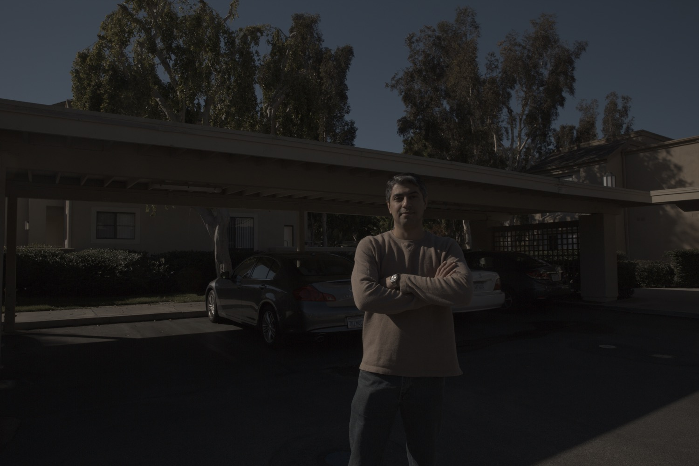
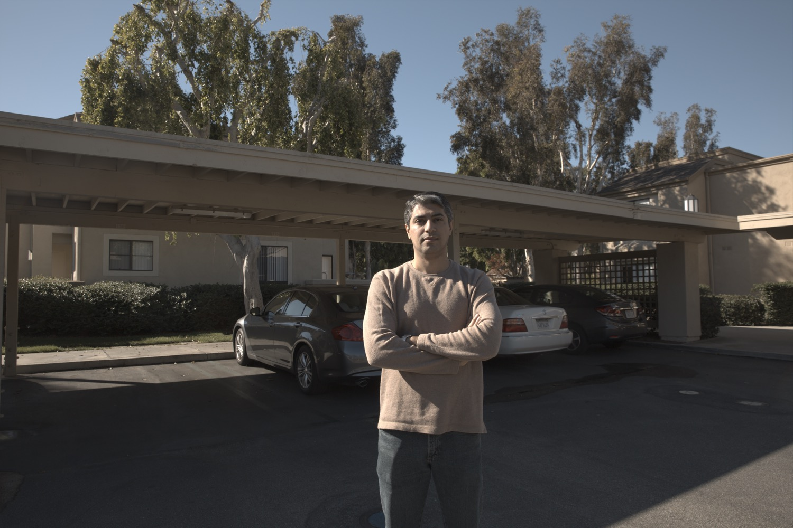
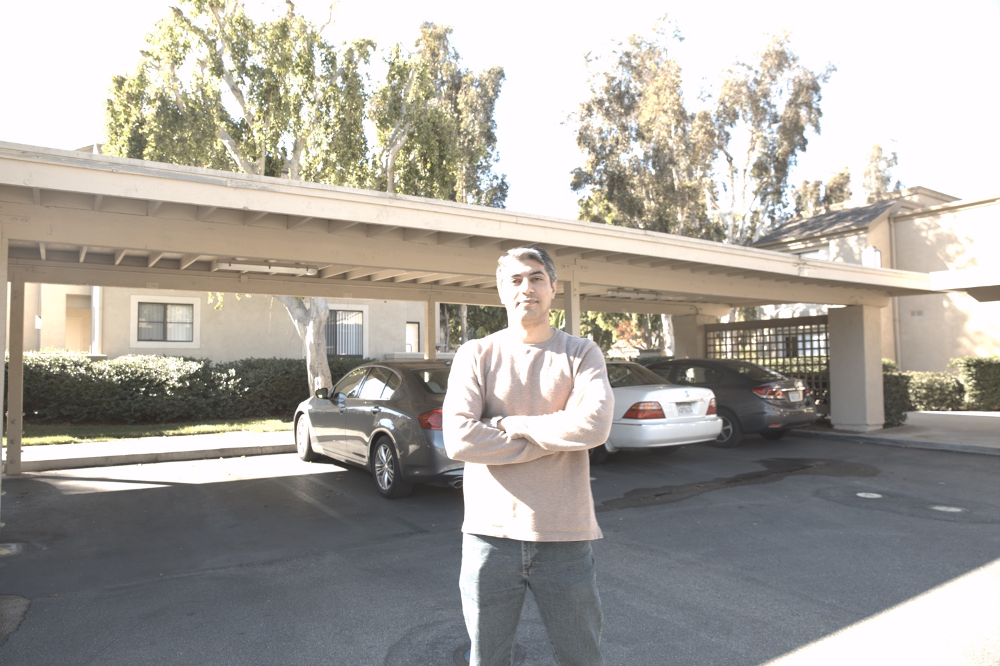
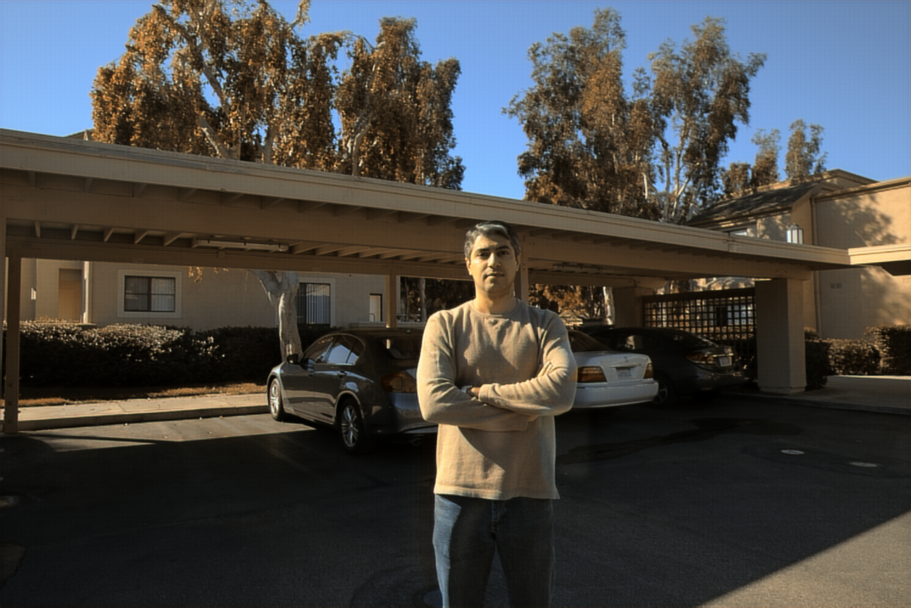

# DeepHDR-pytorch
DeepHDR [1] (ECCV'18) re-implementation using PyTorch framework

## Introduction

This repository is the re-implementation of DeepHDR [1] using PyTorch framework. The [original repository](https://github.com/elliottwu/DeepHDR) [2] is implemented using low-version Python and Tensorflow. To make the architecture clearer and more efficient, we re-implemented it using Pytorch framework and add some basic optimizations. 

## Requirements

- PyTorch 1.4+
- Cuda version 10.1+
- OpenCV
- numpy, tqdm, scipy, etc.

## Getting Started

### Download Dataset

The Kalantari Dataset can be downloaded from https://www.robots.ox.ac.uk/~szwu/storage/hdr/kalantari_dataset.zip [2], or you can execute the following commands to download it.

```bash
cd data
sh get_data.sh
```

### Dataset Model Selection

There are two dataset models provided in `dataset` folder. Using `HDRpatches.py` will generate patches in `patches` folder and will cost ~200GB spaces, but it runs faster. Using `HDR.py` (default) will open image file only when it needs to do so, thus it will save disk space. Feel free to choose the method you want.

### Configs Modifications

You may modify the arguments in `Configs()` to satisfy your own environment, for specific arguments descriptions, see `utils/configs.py`.

### Train

```bash
sh train.sh
```

### Test

Make sure that you have models (`checkpoint.tar`) under `checkpoint_dir` (which is defined in `Configs()`).

```bash
sh test.sh
```

**Note**. `test.py` will dump the result images in `sample` folder.

### Tone-mapping (post-processing)

Generated HDR images are in `.hdr` format, which may not be properly displayed in your image viewer directly. You may use [Photomatix](https://www.hdrsoft.com/) for tonemapping [2]:

- Download [Photomatix](https://www.hdrsoft.com/) free trial, which won't expire.
- Load the generated `.hdr` file in Photomatix.
- Adjust the parameter settings. You may refer to pre-defined styles, such as `Detailed` and `Painterly2`.
- Save your final image in `.tif` or `.jpg`.

### Metric Calculation

```bash
python calc_metric.py --gt_path [Ground Truth Path] --test_path [Test File Path]
```

## Sample

This is a demo display of the testing dataset `002` using the model after only 1 epoch's trainning.

**Original Image**

<table>
  <tr><td align="center"> LDR Image </td><td></td><td></td><td></td></tr>
  <tr><td align="center"> Exposure Bias</td><td align="center">0</td><td align="center">3</td><td align="center">6</td></td></tr>
</table>

**HDR Image (after tonemapping)**



## To-dos

- [x] Training codes
- [x] Evaluating while training
- [x] Testing codes
- [x] Perform the patches calculation in need to save storage
- [x] Visualizing codes
- [x] Code re-organization
- [x] Sample
- [x] Scripts
- [ ] Command-line configurations support
- [ ] Pre-trained model upload
- [x] Multi-gpu support

## Versions

- **v0.10 (Current Version)**: Add metrics support.
- v0.9: Add some necessary scripts.
- v0.8: Add multi-gpu support.
- v0.7: Update dataset selection and fix some bugs.
- v0.6: Update demo display.
- v0.5: Modify the codes to satisfy CUDA environment. 
- v0.4: Complete  visualization codes.
- v0.3: Complete testing codes.
- v0.2: Complete the training codes to support evaluating in training process.
- v0.1: Build the model framework and write dataset codes, training codes and utility codes.

## Reference

[1] Wu, Shangzhe, et al. "Deep high dynamic range imaging with large foreground motions." *Proceedings of the European Conference on Computer Vision (ECCV)*. 2018.

[2] elliottwu/DeepHDR repository: https://github.com/elliottwu/DeepHDR


